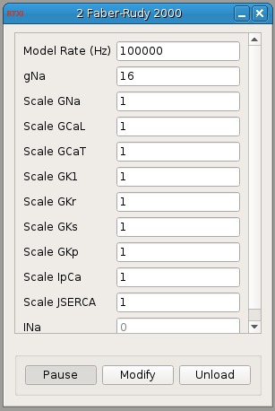

###Faber-Rudy

**Requirements:** None  
**Limitations:** None  

<!--start-->

Faber-Rudy guinea pig cardiomyocyte model.  

<!--end-->

####Input Channels
1. input(0) - Iapp : applied current  (A)

####Output Channels
1. output(0) - Vm : membrane voltage (V)

####Parameters
1. rate - rate of integration (Hz)
2. gNa - sodium conductance

####States
1. INa - sodium current
